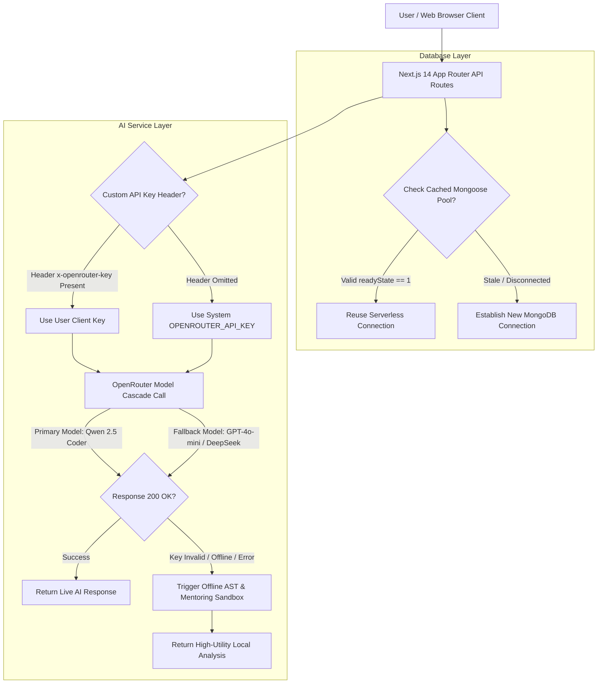

# 🚀 AlgoSpark - AI-Powered DSA Learning & SDE Preparation Platform

<p align="center">
  
</p>

<p align="center">
  <a href="https://nextjs.org/"></a>
  <a href="https://www.typescriptlang.org/"></a>
  <a href="https://tailwindcss.com/"></a>
  <a href="https://openrouter.ai/"></a>
  <a href="https://www.mongodb.com/"></a>
  <a href="https://vercel.com/"></a>
</p>

---

## 🌟 Overview

**AlgoSpark** is an all-in-one, highly interactive, and visually stunning Data Structures and Algorithms (DSA) learning platform. Designed for developers preparing for technical coding interviews, AlgoSpark combines an **electric violet glassmorphic design system** with real-time AI mentoring, step-by-step algorithm visualizers, an interactive SVG roadmap, custom problem sheets, and an in-browser Monaco code editor with Big-O complexity analysis.

Built on **Next.js 14 App Router**, **TypeScript**, **Tailwind CSS**, and **MongoDB**, AlgoSpark is fully optimized for production deployment on **Vercel** with serverless database pooling and resilient zero-downtime AI fallbacks.

---

## 🏗️ System Architecture & Workflow

Below is the system architecture illustrating request routing, Vercel serverless database connection caching, and the resilient multi-model AI fallback cascade:



---

## ✨ Key Features

### 🧠 1. AI DSA Problem Analyzer & Progressive Hints
* **LeetCode-Style Split Workspace**: Responsive dual-column layout with real-time markdown parsing.
* **Step-by-Step Problem Breakdown**: Paste any algorithm query to get beginner summaries, brute force vs optimal approaches, and Big-O time/space complexity notes.
* **Progressive Hints System**: Reveal progressive pedagogical hints one by one without spoiling full code solutions.

### ⏱️ 2. AI & Local AST Big-O Complexity Finder
* **Instant O-Notation Computation**: Calculates worst-case time complexity (e.g. $O(n)$, $O(n \log n)$, $O(n^2)$) and space requirements for custom code.
* **Dual-Engine Execution**: Queries OpenRouter models for deep structural code analysis, automatically falling back to an offline AST regex analyzer for zero 500 server crashes.

### 🤖 3. AlgoSpark AI Mentor Chatbot
* **Context-Aware SDE Tutor**: Ask questions about array techniques, sliding window patterns, tree traversals, dynamic programming, or graph algorithms.
* **Persistent History**: Authenticated users store past mentor conversations securely inside MongoDB.

### 🌲 4. Interconnected SVG Roadmap & Curriculum Mastery
* **SVG Vector Flowcharts**: Visual pathways connecting learning topics from basic recursion to advanced Dijkstra & Dynamic Programming.
* **Filterable Nodes**: Dynamic filters for Required, Alternative languages (C++, Java, Python, JS), and Optional deep dives.
* **Live Mastery Tracker**: Displays real-time completion percentage and progress badges.

### 📊 5. SDE Revision Hub & 3D Interactive Flashcards
* **Complexity Matrix**: Quick-reference cheat sheet for standard data structures and sorting algorithms across best, average, and worst cases.
* **3D-Flipping Flashcards**: Interactive cards covering interview patterns (Two Pointers, Fast & Slow Pointers, Sliding Window, Prefix Sums).

### 🎬 6. Interactive Algorithm Visualizer
* **Sorting Animations**: Real-time step-by-step state animations for Bubble Sort, Merge Sort, and Quick Sort.
* **Graph Traversals**: Animated node exploration for Breadth-First Search (BFS) and Depth-First Search (DFS).
* **HashMap Collisions**: Visual explanation of chaining and hash index calculations.

### 💻 7. Browser Code Playground & Monaco Editor
* **Full Monaco Integration**: In-browser code editor with syntax highlighting, line numbers, automatic formatting, and console output capture.
* **Integrated Analysis**: Switch tabs instantly between code execution and Big-O complexity analysis.

### 📁 8. Custom & Curated Problem Sheet Manager
* **Curated SDE Sheets**: Includes pre-built templates for **Striver 75**, **Blind 75**, and **NeetCode 150**.
* **Custom Sheet Creator**: Save custom problem collections to your profile or local storage.

### 🔥 9. Gamified Active Streak Tracking
* **DB & Local Storage Sync**: Automatically calculates active study days, tracking daily progress with an animated orange flame badge (🔥) in the navigation bar.

---

## 📂 Project Directory Structure

```text
Dsa-Ditcher/
├── src/
│   ├── app/                    # Next.js 14 App Router pages & API routes
│   │   ├── api/
│   │   │   ├── ai/             # AI endpoints (analyze, chat, complexity)
│   │   │   ├── auth/           # Authentication endpoints (login, register)
│   │   │   ├── chats/          # Mentor chat history CRUD
│   │   │   ├── sheets/         # Custom problem sheet CRUD
│   │   │   └── users/          # User profile & streak stats
│   │   ├── globals.css         # HSL electric violet design tokens & Tailwind imports
│   │   ├── layout.tsx          # Master layout wrapper with AuthProvider & Toast notifications
│   │   ├── page.tsx            # Main application landing entrypoint
│   │   ├── login/              # Login route
│   │   └── signup/             # Signup route
│   ├── components/             # Reusable React components
│   │   ├── Dashboard.tsx       # Main user stats & streak overview
│   │   ├── ProblemAnalyzerEnhanced.tsx # AI analyzer & chat panel
│   │   ├── CodePlayground.tsx  # Monaco editor & runner
│   │   ├── VisualizationsFixed.tsx # Interactive sorting & graph visualizers
│   │   ├── DsaCheatSheet.tsx   # Complexity matrix & 3D flashcards
│   │   ├── DsaSheetManager.tsx # Curated & custom problem sheet tracker
│   │   ├── Navbar.tsx          # Navigation bar & AI Settings modal
│   │   └── roadmap/            # SVG roadmap components & topic modal
│   ├── context/                # React AuthContext state provider
│   ├── data/                   # Curated sheets & roadmap topic metadata
│   ├── hooks/                  # Custom hooks (roadmap progress tracking)
│   ├── lib/                    # Core utilities, API fetcher, & MongoDB connection
│   ├── server/                 # Server services, auth utils, & Mongoose models
│   └── types/                  # TypeScript interfaces & type definitions
├── public/                     # Static public assets
├── algospark_banner.png        # Landing banner graphic
├── next.config.mjs             # Next.js build configuration
├── tailwind.config.ts          # Tailwind CSS custom themes & animation keyframes
├── tsconfig.json               # TypeScript compiler config
├── vercel.json                 # Vercel serverless deployment manifest
└── README.md                   # Master project documentation
```

---

## ⚙️ Environment Variables Reference

Create a `.env` file in the root directory:

```env
# Database Configuration
MONGODB_URI=mongodb://127.0.0.1:27017/dsa-ditcher

# Authentication Secret (Minimum 32 characters)
JWT_SECRET=your_super_strong_jwt_secret_min_32_chars

# OpenRouter AI API Key (Optional - Offline local sandbox activates if omitted)
OPENROUTER_API_KEY=sk-or-v1-your-openrouter-key

# Client Base URL
NEXT_PUBLIC_API_URL=/api
```

---

## 🛠️ Quickstart Guide

### Prerequisites
* **Node.js**: v18.0.0 or higher
* **npm**: v9.0.0 or higher
* **MongoDB**: Local MongoDB instance or MongoDB Atlas connection URI

### Installation & Local Run

1. **Clone Repository & Install Dependencies**:
   ```bash
   git clone https://github.com/anuragsinghrajput123456789/algo-spark-guide.git
   cd Dsa-Ditcher
   npm install
   ```

2. **Configure Environment Variables**:
   ```bash
   cp .env.example .env
   ```

3. **Start Development Server**:
   ```bash
   npm run dev
   ```

4. **Access Platform**:
   Open [http://localhost:3000](http://localhost:3000) in your browser.

---

## 🚀 Deploying to Vercel

AlgoSpark is pre-configured for one-click deployment on **Vercel**:

1. **Push Code to GitHub**:
   Ensure all changes are committed and pushed to your GitHub repository.

2. **Import Repository in Vercel**:
   Go to [Vercel Dashboard](https://vercel.com/new) -> **Import Project** -> Select your repository.

3. **Configure Environment Variables in Vercel Settings**:
   - `MONGODB_URI`: `mongodb+srv://<user>:<password>@cluster.mongodb.net/dsa-ditcher`
   - `JWT_SECRET`: `your_production_secret_key`
   - `OPENROUTER_API_KEY`: `sk-or-v1-...`
   - `NEXT_PUBLIC_API_URL`: `/api`

4. **Deploy**:
   Click **Deploy**. Vercel will automatically build the Next.js App Router project!

---

## 📜 License

This project is licensed under the **MIT License**.
