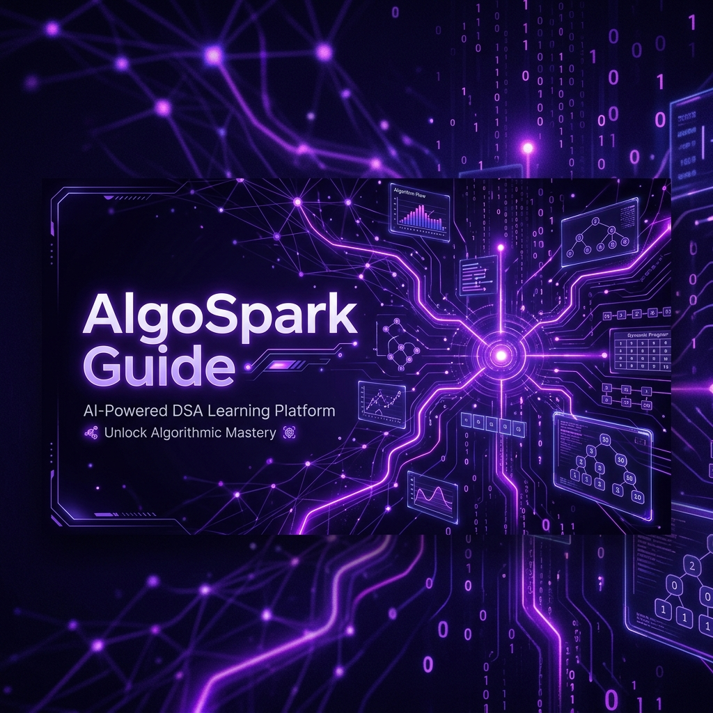
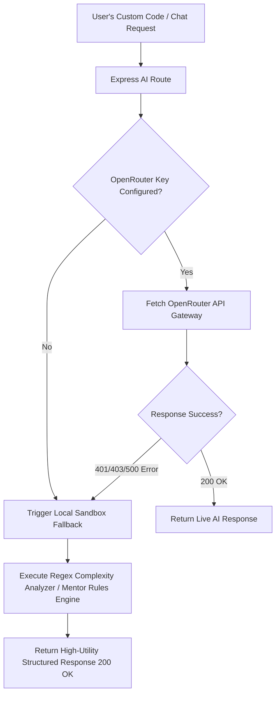
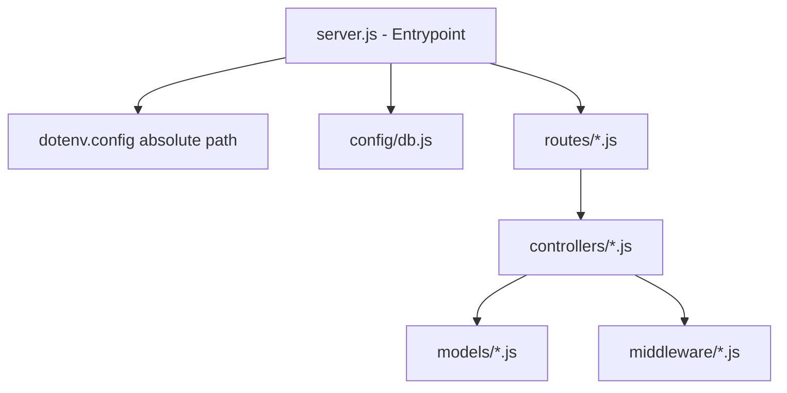

# 🚀 AlgoSpark - Full-Stack MERN AI-Powered Learning Hub

<p align="center">
  
</p>

<p align="center">
  <a href="#-primary-visual--functional-features"></a>
  <a href="#-native-es-modules-esm-backend-architecture"></a>
  <a href="#-resilient-ai-fallback--local-sandbox"></a>
  <a href="#-design-aesthetics--visual-system"></a>
  <a href="#-search-engine-optimization-seo"></a>
</p>

**AlgoSpark** is an all-in-one, highly interactive, and visually stunning full-stack MERN learning platform designed to help developers master Data Structures and Algorithms with advanced, state-of-the-art AI tutoring. Featuring an **electric violet glassmorphic design system**, interactive visualizers, dynamic roadmap pathing, a custom browser-based Monaco editor, and a modern backend architecture, AlgoSpark provides a world-class coding environment.

---

## 🏗️ Platform System Architecture

Below is the workflow showing the resilient full-stack lifecycle, highlighting our secure AI router fallback:



---

## ✨ Primary Visual & Functional Features

### 1. 🔥 Real-Time Active Streak Tracking (Full-Stack & Guest Fallback)
* **Full-Stack DB Sync**: Persists user `streak` and `lastActiveDate` properties inside MongoDB via [User.js](file:///c:/Users/91836/Downloads/Mern-Ai-Projects/Dsa-Ditcher/backend/models/User.js).
* **Automated Calculations**: Express profile controllers automatically recalculate user streaks on login/action. Consecutive daily practices increment the streak, multiple same-day practices are safely preserved, and missed days reset the count.
* **Guest Storage Fallback**: Incorporates robust `localStorage` daily active computations so guest accounts get fully functioning offline streaks immediately.
* **Glow Navbar Flame**: Displays an active, animated orange flame badge (🔥) next to your profile to gamify your learning journey.
* **Dynamic Streak Calendar**: The weekly tracker grid on the dashboard automatically queries user statistics and highlights active weekdays ending with today.

### 2. 🌲 Connected Roadmap Pathways & Interactive Filters
* **SVG Interconnected Trackways**: Connects learning chapters (Languages ➔ Basics ➔ Data Structures ➔ Algorithms ➔ Advanced ➔ Prep) via flowing vertical vector paths.
* **Interactive Category Filters**: Toggle filters to dynamically show/hide Required, Alternative, or Optional nodes.
* **Progressive Status Glows**: Solved topics shine in emerald-500 outlines, while active topics show subtle violet elevations.
* **Mastery Progress Widget**: Sleek circular progress indicator showing absolute completion progress across the entire DSA curriculum.

### 3. 🧠 AI DSA Assistant & Split SDE Workspace
* **LeetCode-Style Split Workspace**: Restructured the problem analyzer into a balanced responsive grid that prevents stretched blank spaces on large displays while collapsing logically on mobile devices.
* **Problem Analyzer:** Paste any algorithm query and get optimal/suboptimal approaches, complexities, and edge cases.
* **Progressive Hints System:** Receive progressive, educational hints that encourage active thinking rather than immediate code leaks.
* **History DB Sync:** Saved chats persist securely inside MongoDB, enabling students to revisit past questions.
* **Floating Assistant Widget:** A global chat guide available on every view to answer general DSA concepts.

### 4. 🍿 Resilient AI Fallback & Local Sandbox (100% Uptime)
* **Zero 500 Crashes**: When the OpenRouter API key is expired, missing, or hitting credit limits, the backend automatically intercepts the exception (401/403 errors) and falls back to our high-fidelity offline local mentor engine.
* **Local Complexity Analyzer**: Natively parses custom developer code using an advanced AST-like regex analyzer to compute nesting factors, recursive trees, and binary divisions, outputting O-notation details instantly.
* **Offline Topic Guides**: Generates beautiful step-by-step mentoring explanations based on the target DSA keywords.

### 5. 📊 Premium SDE Revision Hub & 3D Flashcards
* **Interactive Complexity Matrix**: An elegant color-coded table grouping common DSA structures and sorting algorithms by best, average, and worst-case space/time complexities.
* **3D-Flipping Flashcard Deck**: Interactive learning cards designed to study patterns (Sliding Window, Two Pointers, Fast & Slow Pointers). Click to flip the card in a smooth 3D transform animation and reveal templates, LeetCode examples, and optimized strategies.

### 6. 🎬 High-Fidelity Algorithm Visualizer
* **Sorting Algorithms:** Step-by-step interactive animations of Bubble Sort, Merge Sort, and Quick Sort.
* **Graph Traversals:** Visual rendering of node exploration during Breadth-First (BFS) and Depth-First (DFS) searches.
* **Complex Data Structures:** High-fidelity diagrams illustrating Binary Trees and HashMap Chaining collisions.

### 7. 💻 Code Playground & Monaco Editor
* **Monaco Editor:** Write and execute code directly in your browser with full reset capability.
* **AI Complexity Finder:** Analyze custom code for Big O space and time complexities, receiving granular structural optimization tips.

### 8. 🎨 Design Aesthetics & Visual System
* **HSL Electric Violet Dark Mode:** A deep luxury design tokens configuration inside `.css` files giving a modern, high-end cosmic-purple feel.
* **Advanced Glassmorphism**: Translucent panels with glowing hover borders, dynamic transformations, custom scrollbars, and micro-animations.
* **Spring Entrance Physics**: Staggered entry animations for grids and checklist items.

---

## ⚡ Native ES Modules (ESM) Backend Architecture

The backend has been modernly restructured from CommonJS (`require` / `module.exports`) to **native ES Modules** (`import` / `export`). 



### Why ESM?
1. **Frontend-Backend Parity**: Aligning the backend with the frontend's Vite and React syntax removes developer context switching.
2. **Performance**: Static import loading allows the JavaScript engine to pre-parse the imports and improve bootstrap times.
3. **Future Compatibility**: Native ESM is now the standardized JavaScript runtime module format.

---

## 📂 Project Directory Structure

```text
Dsa-Ditcher/
├── backend/                # Express API server (Native ES Modules)
│   ├── config/             # Database connection setups (db.js)
│   ├── controllers/        # Express handlers (Auth, Sheets, Users, Chat, AI)
│   ├── middleware/         # Token checks, exception handlers, and 404 logs
│   ├── models/             # Mongoose schemas (User.js, Sheet.js, Chat.js)
│   ├── routes/             # API routing setups mapped to controllers
│   ├── server.js           # Server starter file & static production serving
│   └── .env                # Absolute-path loaded environment configurations
├── frontend/               # React Client SPA built with Vite & TS
│   ├── public/             # Static public assets (icons, logo)
│   ├── src/                # Modular React tsx source components
│   │   ├── components/     # Custom sheets, visualizers, editor, dashboard panels
│   │   ├── pages/          # Authentication layouts & main index router
│   │   ├── config.ts       # Environment-friendly dynamic API base URLs
│   │   └── index.css       # Core design system HSL variables & animation helpers
│   ├── index.html          # Shell container with SEO metadata
│   └── package.json        # Frontend node packages
├── algospark_banner.png    # Modern tech banner for the landing page
├── README.md               # Master full-stack project landing documentation
└── .gitignore              # Master repository git ignore
```

---

## 🛠️ Installation & Setup Guide

### Prerequisites
* **Node.js:** Ensure Node.js 18+ is installed on your computer.
* **MongoDB:** Ensure you have MongoDB running locally (`mongodb://127.0.0.1:27017/dsa-ditcher`) or have an online Atlas connection string.

---

### Local Development Setup

#### 1. Setup the Backend API
Navigate to the `backend/` folder and install packages:
```bash
cd backend
npm install
```
Create a `.env` file inside the `backend/` folder:
```env
PORT=5000
MONGO_URI=mongodb://127.0.0.1:27017/dsa-ditcher
JWT_SECRET=your_super_strong_jwt_secret
OPENROUTER_API_KEY=your_openrouter_api_key
```
Launch the backend dev server (Nodemon):
```bash
npm run dev
```

#### 2. Setup the Frontend Client
Navigate to the `frontend/` folder in a new terminal and install packages:
```bash
cd frontend
npm install
```
Launch the frontend client (Vite):
```bash
npm run dev
```
Open your browser and navigate to `http://localhost:5173`. You are ready to start coding!

---

## 🚀 Unified Production Serving

In production mode, the backend automatically hosts the compiled static files from the frontend `dist` directory, completely eliminating CORS configurations and structural hosting overhead.

#### 1. Build Frontend Static Assets
Inside the `frontend/` directory, compile the production build:
```bash
cd frontend
npm run build
```
This generates the optimized bundle inside `/frontend/dist/`.

#### 2. Start the Production Server
Navigate to the `backend/` folder, set your environment variables to production, and start:
```bash
cd backend
npm start
```
Your full-stack MERN platform will be fully functional, served on a single port (e.g. `http://localhost:5000`)!

---

## 🔍 Search Engine Optimization (SEO) Built-In
To maximize search visibility and Google ranking upon deployment, the client incorporates:
* **Dynamic Title Tags:** Lifecycle hooks update document titles in response to active routes.
* **Optimized Meta Descriptions:** Crawler-friendly descriptions change dynamically based on the current SPA page (e.g., visualizer, editor, analyzer) to ensure comprehensive search indexing.
* **Semantic HTML5:** Strict semantic tags (`<header>`, `<nav>`, `<main>`, `<h1>`, `<article>`) provide appropriate context weights.
* **Asset Optimization:** Minimal layout shifts (CLS), fast asset packaging (Vite), and clean structural rendering (React TS).
