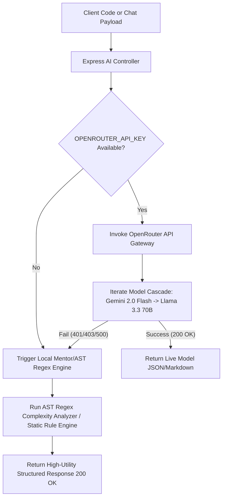

# AlgoSpark API Endpoint and Flow Guide

This document catalogs the REST API endpoints of **AlgoSpark (DSA-Ditcher)**, explains the standard request/response lifecycle, and details the AI router invocation sequence with local fallback mechanisms.

---

## 🔌 API Endpoints Catalog

All API endpoints are prefixed with `/api`. Access rules are defined as:
* 🔓 **Public**: Requires no authentication.
* 🔒 **Private**: Requires a valid HTTP header `Authorization: Bearer <JWT_TOKEN>`.

### 1. Authentication (`/api/auth`)
* `POST /register` | 🔓 | Register a new AlgoSpark user account.
  * **Middleware**: `authRateLimiter`, `validate(registerUserSchema)`
  * **Body**: `{ "name": "Developer Name", "email": "user@domain.com", "password": "securepassword" }`
  * **Response**: `201 Created` + `{ "_id": "...", "name": "...", "email": "...", "level": "Beginner", "problemsSolved": 0, "streak": 1, "token": "JWT_TOKEN" }`
* `POST /login` | 🔓 | Log in an existing user account.
  * **Middleware**: `authRateLimiter`, `validate(loginUserSchema)`
  * **Body**: `{ "email": "user@domain.com", "password": "securepassword" }`
  * **Response**: `200 OK` + `{ "_id": "...", "name": "...", "email": "...", "level": "Beginner", "problemsSolved": 5, "streak": 3, "token": "JWT_TOKEN" }`

### 2. User Profile & Streak Stats (`/api/users`)
* `GET /profile` | 🔒 | Fetch details of the authenticated user.
  * **Middleware**: `apiRateLimiter`, `protect`
  * **Response**: `200 OK` + `{ "_id": "...", "name": "...", "email": "...", "level": "Intermediate", "problemsSolved": 12, "streak": 4, "lastActiveDate": "2026-08-14T20:00:00.000Z" }`
* `PUT /stats` | 🔒 | Update user problem count and recalculate active streak.
  * **Middleware**: `apiRateLimiter`, `protect`, `validate(updateUserStatsSchema)`
  * **Body**: `{ "problemsSolved": 13, "level": "Intermediate" }`
  * **Response**: `200 OK` + `{ "_id": "...", "name": "...", "problemsSolved": 13, "streak": 5, "lastActiveDate": "..." }`

### 3. Custom DSA Problem Sheets (`/api/sheets`)
* `GET /` | 🔒 | Retrieve all problem sheets created by the user.
  * **Middleware**: `apiRateLimiter`, `protect`
  * **Response**: `200 OK` + Array of Sheet documents (`[{ "_id": "...", "title": "Blind 75 Revision", "description": "Top patterns", "problems": "[...]", "difficulty": "Hard", "tags": "Arrays,DP" }]`)
* `POST /` | 🔒 | Create a new custom DSA problem sheet.
  * **Middleware**: `apiRateLimiter`, `protect`, `validate(createSheetSchema)`
  * **Body**: `{ "title": "Striver SDE Sheet", "description": "Core 180 questions", "problems": "[...]", "difficulty": "Medium", "tags": "Graphs,Trees" }`
  * **Response**: `201 Created` + Created Sheet document.
* `PUT /:id` | 🔒 | Update an existing problem sheet.
  * **Middleware**: `apiRateLimiter`, `protect`, `validate(updateSheetSchema)`
  * **Body**: `{ "title": "Updated Sheet", "problems": "[...]" }`
  * **Response**: `200 OK` + Updated Sheet document.
* `DELETE /:id` | 🔒 | Delete a problem sheet.
  * **Middleware**: `apiRateLimiter`, `protect`, `validate(deleteSheetSchema)`
  * **Response**: `200 OK` + `{ "message": "Sheet removed successfully" }`

### 4. AI Chat History Sync (`/api/chats`)
* `GET /` | 🔒 | Retrieve chat history threads for the authenticated user.
  * **Middleware**: `apiRateLimiter`, `protect`
  * **Response**: `200 OK` + Array of Chat documents (`[{ "_id": "...", "role": "user", "content": "How does BFS work?" }, { "role": "ai", "content": "..." }]`)
* `POST /` | 🔒 | Save a chat message to history.
  * **Middleware**: `apiRateLimiter`, `protect`, `validate(saveChatSchema)`
  * **Body**: `{ "role": "user", "content": "Explain Binary Search" }`
  * **Response**: `201 Created` + Saved Chat document.
* `DELETE /` | 🔒 | Clear all chat history.
  * **Middleware**: `apiRateLimiter`, `protect`
  * **Response**: `200 OK` + `{ "message": "Chat history cleared successfully" }`
* `DELETE /:id` | 🔒 | Delete a specific chat message.
  * **Middleware**: `apiRateLimiter`, `protect`, `validate(deleteChatSchema)`
  * **Response**: `200 OK` + `{ "message": "Chat message deleted" }`

### 5. Core AI & Sandbox Operations (`/api/ai`)
* `POST /analyze` | 🔓/🔒 | Analyze algorithm problem statement (approaches, space/time complexities, edge cases).
  * **Middleware**: `aiRateLimiter`, `validate(analyzeProblemSchema)`
  * **Body**: `{ "problemDescription": "Given an array of integers nums and an integer target, return indices of two numbers..." }`
  * **Response**: `200 OK` + Structured JSON `{ "title": "...", "optimalApproach": "...", "timeComplexity": "O(n)", "spaceComplexity": "O(n)", "edgeCases": [...] }`
* `POST /chat` | 🔓/🔒 | Prompt the AI DSA Mentor chatbot (with context history).
  * **Middleware**: `aiRateLimiter`, `validate(chatWithAISchema)`
  * **Body**: `{ "message": "What is the difference between BFS and DFS?", "history": [...] }`
  * **Response**: `200 OK` + `{ "response": "Markdown response with mentor guidance..." }`
* `POST /complexity` | 🔓/🔒 | Analyze custom source code for space and time Big O complexity.
  * **Middleware**: `aiRateLimiter`, `validate(analyzeComplexitySchema)`
  * **Body**: `{ "code": "function twoSum(nums, target) { ... }", "language": "javascript" }`
  * **Response**: `200 OK` + `{ "timeComplexity": "O(n)", "spaceComplexity": "O(n)", "explanation": "...", "optimizations": [...] }`

---

## 🔄 API Request Lifecycle Flow

Every REST API request follows a structured security pipeline through Express middleware components:

```
[Client App Request]
        │
        ▼
[CORS Origin Check] ──(Blocked)──> 403 Forbidden
        │
        ▼
[Helmet & Compression Headers]
        │
        ▼
[Express Rate Limiter] ──(Limit Exceeded)──> 429 Too Many Requests
        │
        ▼
[JSON Body Parser (100kb limit)]
        │
        ▼
[Auth Middleware (protect)] (For 🔒 Endpoints)
  ├── Extract Bearer Token from Authorization Header
  ├── Verify JWT Signature with process.env.JWT_SECRET
  └── Lookup User in MongoDB Atlas (exclude password hash)
        │
        ▼ (Token Invalid or User Missing ──> 401 Unauthorized)
[Schema Validator Middleware] (Joi / Zod Validation)
        │
        ▼ (Invalid Payload ──> 400 Bad Request)
[Controller Business Logic Execution]
        │
        ▼
[Mongoose DB Operation / AI Gateway Engine]
        │
        ▼
[200 / 201 JSON Response to Client]
```

---

## 🍿 AI Router Resilience & Local Sandbox Fallback

AlgoSpark utilizes a dual-tier gateway pattern ensuring zero 500 error crashes even when external AI credit limits or key invalidations occur:


